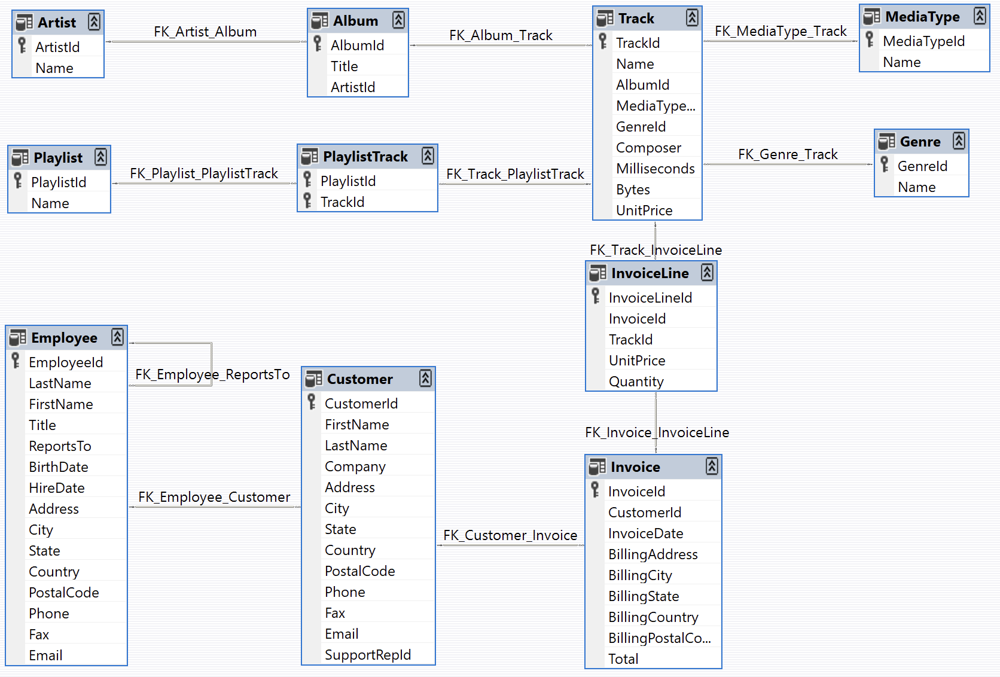

# Chinook Music

## Descripción

Este proyecto es una base de datos enfocada al mundo de la musica, cuenta con canciones, artistas, albumes entre otras entidades y atributos que ayudan al desarrollo del sistema general el cual tiene como objetivo segmentar la simulaciòn de una base de datos de un servicio de streaming musical, contiene consultas, triggers y eventos para filtrar los resultados. Ayuda a los usuarios a hacerse una idea general de como se maneja una base de datos sin manejar datos reales.

## Diagrama 

## Requisitos del sistema

* Es necesario contar con un sistema operativo compatible con MySQL
* Cuenta con soporte a Linux, Mac y Windows
* Se opera por medio de MySQL Workbench

## Instalaciòn y configuraciòn

1. Descargue los archivos del repostorio
2. Abra MySQL Workbench
3. Cargue el archivo dml.sql
4. Repita el proceso con los demàs archivos
5. Para ejecutar las consultas, funciones, eventos y triggers hacer click en el icono del rayo arriba a la izquierda
6. Altere los datos y consultas para encontrar diferentes resultados

## Archivos

* ddl.sql (Creación de base de datos con tablas y relaciones)
* dml.sql (inserciones de datos)
* dql_select.sql (Consultas)
* dql_funciones.sql (funciones)
* dql_triggers.sql (triggers)
* dql_eventos.sql (eventos)
* Readme.md
* Diagrama.jpg (Modelo de datos)

## Autor

Proyecto realizado por Luis Fernando Pèrez Salamanca
